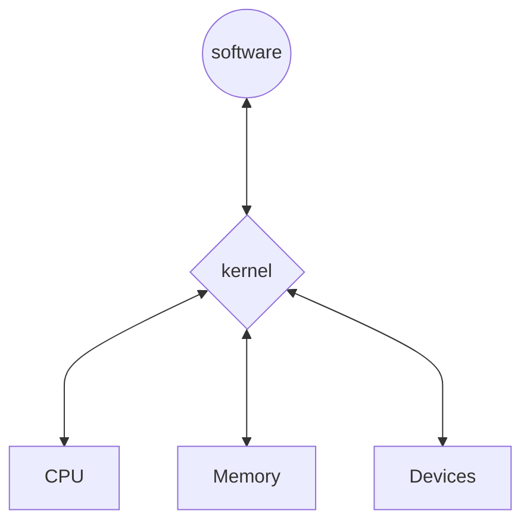
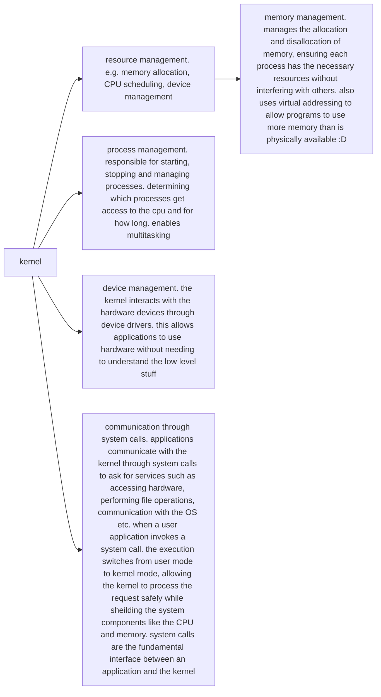

# whats a kernel? and what does it even do?
- the core of an OS. acts as the bridge between software and hardware components 

- manages system resources, stability. ensures efficient and secure multitasking. prevents unauthorised resource access and a bunch of other stuff

# kernel space vs user space 
%% (copied this cuz i couldnt have said it any better) %%
In modern operating systems, memory is divided into two primary areas: **kernel space** and **user space**. This separation provides memory protection and hardware protection from malicious or errant software behavior.

**Kernel space** is a privileged memory area where the operating system kernel, kernel extensions, and most device drivers execute. Code running in kernel space operates in a privileged mode (often referred to as kernel mode or supervisor mode) and has unrestricted access to system resources. This includes the ability to manipulate memory, interact directly with hardware peripherals, execute any processor instruction, and modify system control settings. Kernel-level code is essential for managing system resources and performing critical functions like process scheduling, memory management, and handling hardware interrupts.

**User space**, on the other hand, is the memory area where application software and some drivers execute. Each user space process typically runs in its own virtual memory space and has limited access to system resources. User space programs operate in a restricted environment, lacking direct access to hardware or critical system components. This isolation prevents them from interfering with the system's core functions or other processes. Applications in user space interact with the kernel through system calls (syscalls), which allow them to request services like file operations, memory allocation, or network communication.

The distinction between kernel and user space is often implemented using **[[CPU protection rings]]**. In the x86 architecture, for example, there are four rings (0–3), with ring 0 being the most privileged (kernel mode) and ring 3 being the least privileged (user mode). When a user space application needs to perform a privileged operation, it triggers a system call, which transitions the CPU into kernel mode to execute the requested operation on behalf of the application.

This separation provides **_two_** major advantages:
- Security: Memory and hardware access are controlled by the kernel, preventing unauthorized or accidental interference by user space applications.
- Stability: A misbehaving user space process cannot directly corrupt kernel memory or other processes, which helps maintain system stability.

_**In summary**_:
- Kernel space is where the operating system kernel runs and manages system resources with full privileges.
- User space is where applications run with restricted privileges and must use system calls to request kernel services.
# types of kernels
- there are 5 types of kernels 
	- [[#Monolithic]] 
	- [[#Micro]]
	- [[#Hybrid]]
	- [[#Exo]]
	- [[#Nano]]
### Monolithic
- all OS services run in kernel space. 
- tightly integrated with everything in terms of OS services. 
- tends to have a huge complex codebase.
- is simpler to design since it has a unified structure.
- has lower latency due to requiring less context switches and system calls and interrupts being handled directly by the kernel.
- introduces security concerns since everything runs in kernel space and having a vuln in a single service can compromise the entire OS. 
- tends to be less stable as well and more difficult to maintain since everything is so interconnected and modularity being very limited
### Micro
- used in small OSs 
- has a minimalistic approach. 
- tends to be more stable and reliable since most of its OS services run outside the kernel space
- is modular due to each OS services running independantly of eachother
- easier to port to different hardware architectures. 
- easier to debug as well. and due to the modularity its way more flexible.
- tends to be way slower as well since it requires more context switches between user space and kernel space
- more difficult to develop becuase modularity and more synchronization mechanisms 
### Hybrid
- a combination of monolithic and micro kernels. 
- has the modularity of micro kernels and the fewer context switches of monolithic kernels. 
- isolates drivers and other kernel components in seperate protection domains so more reliable
- way more complex and diffucult to maintain due to obvious reasons
- higher resource usage and larger attack surface so can be less secure
### Exo
- basically the arch linux of kernels. 
- allocates physical resources to application with as less hardware abstractions as possible so better performance. focuses on application level management of resources 
- allows nitty gritty control over resource allocation so better security than traditional kernels
- extremely modular 
- extremely complex to make stuff for it and maintain it for obvious reasons 
- limited support for it since its still an emerging tech
### Nano
- has hardware abstraction but without system services.
- extremely small and has only the most necessary stuff needed to run the system. has the downside of having limited functionality and compatibility
- extremely modular, portable and fast. wont be as fast for stuff it wasnt built for
- better security due to extremely small attack surface